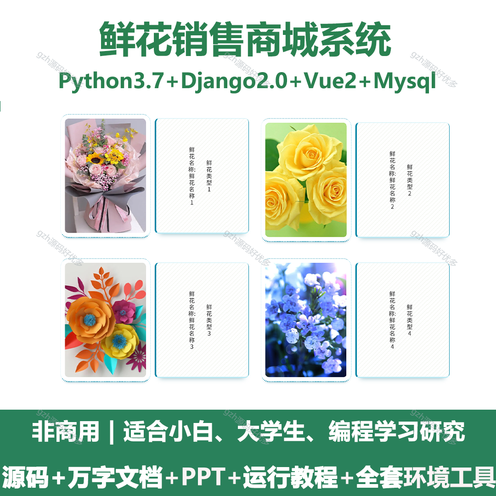
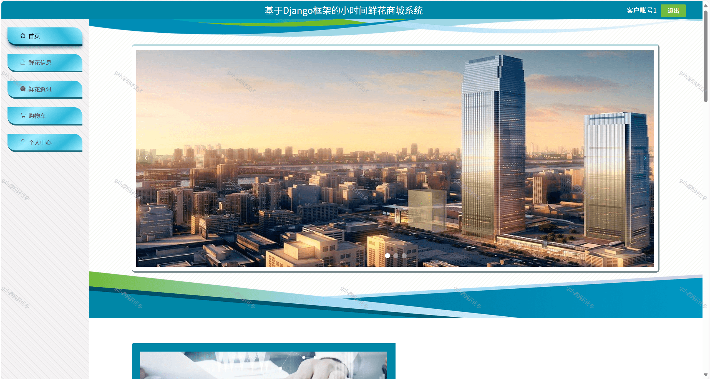
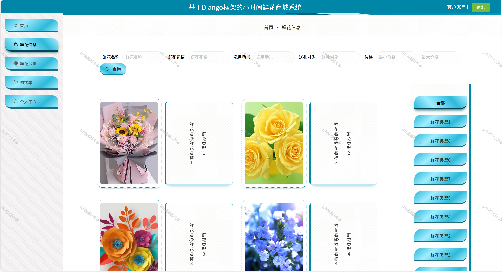
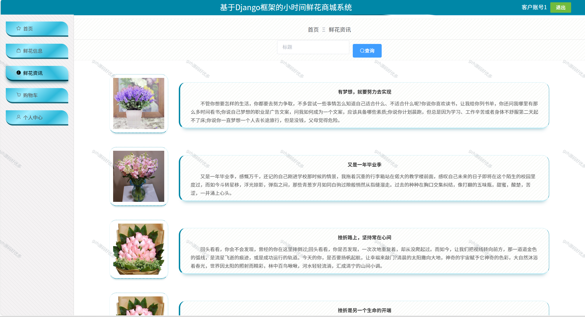
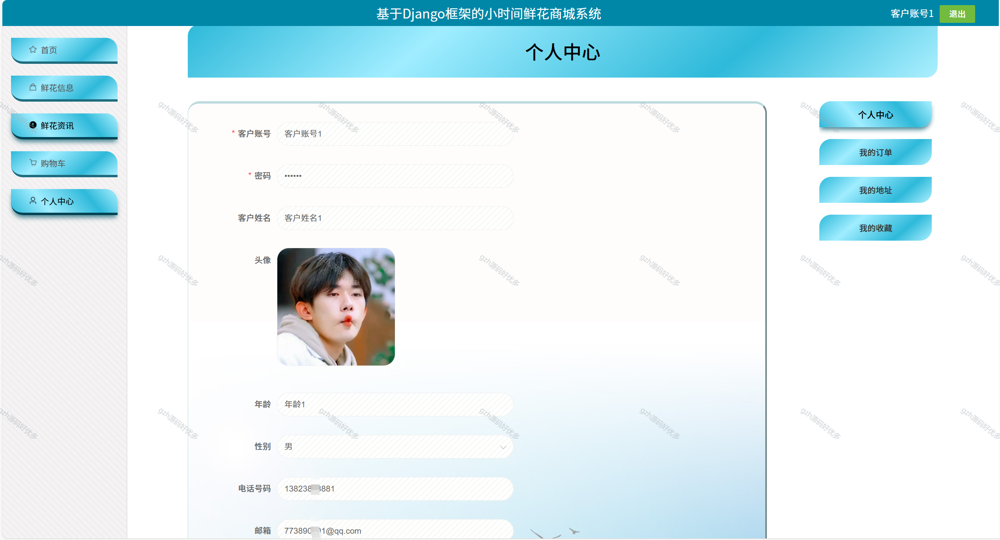
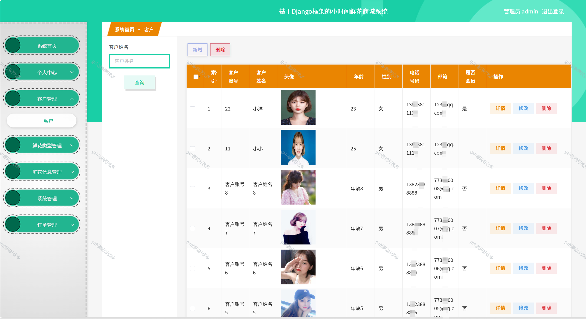
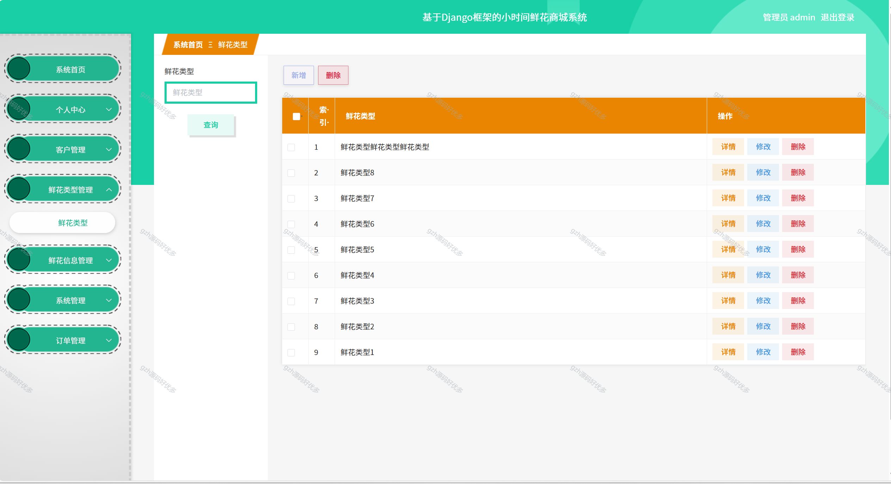
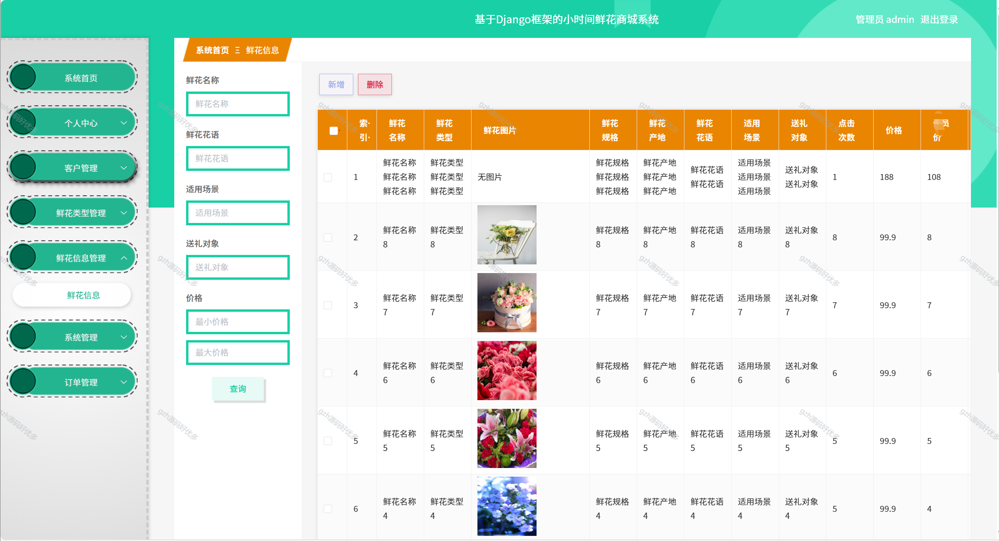
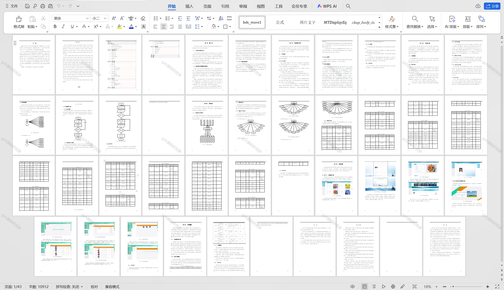

# python067
python067基于Python+Django的鲜花销售商城系统+LW+PPT
 
## 查看主页获取源码

### 一、关键词
鲜花商城管理系统，花艺在线销售系统，鲜花线上商城系统

### 二、作品包含
源码+数据库+万字设计文档+PPT+全套环境和工具资源+本地部署教程

### 三、项目技术
前端技术：Vue2.0、Element-ui
后端技术：Python3.7、Django2.0

### 四、运行环境（以下版本亲测，其他版本兼容性请自行测试）
开发工具：PyCharm + VSCODE

数据库：MySQL5.7（最低要5.7版本）

数据库管理工具：Navicat10+

Python：Python3.7

前端Nodejs：14

浏览器：谷歌浏览器

### 五、项目介绍
项目编号：python067

为了方便用户更好的获得信息，因此，设计一种安全高效的小时间鲜花商城系统极为重要。
该系统采用 Python语言、Django框架和mysql数据库进行开发设计，通过对小时间鲜花商城系统业务流程的分析，分析了其功能性需求，设计了小时间鲜花商城系统，该系统包括管理员和客户二部分。同时还能为用户提供一个方便实用的小时间鲜花商城系统，使得用户能够及时地找到合适自己的小时间鲜花商城系统。管理员界面管理客户的信息，也可以对系统上的所有信息进行修删除查等操作，客户通过本系统可以及时了解小时间鲜花商城系统。

### 六、运行截图

